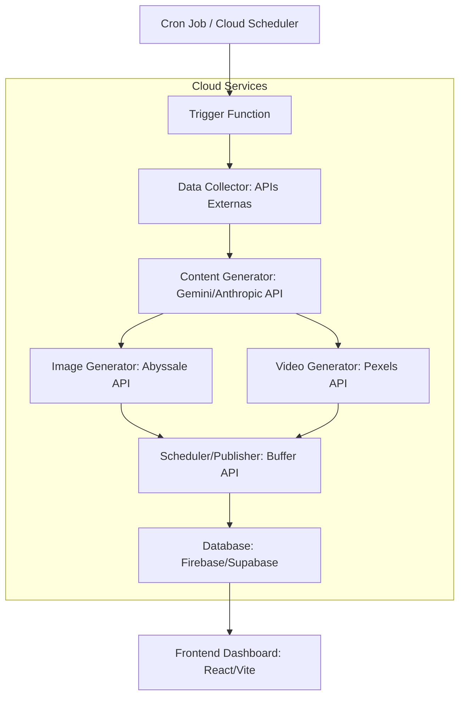

# Plan de Implementación: SOCIAL-AUTO

Este documento detalla la arquitectura y el flujo de ejecución para el sistema de automatización de contenidos sociales.

## 1. Arquitectura del Sistema

El sistema utiliza una arquitectura **Serverless** basada en eventos.



## 2. Flujo de Ejecución

1.  **Activación**: Un temporizador (Cloud Scheduler) activa la función principal cada X horas.
2.  **Recolección**: La función obtiene datos de fuentes externas (Noticias, Clima, etc.).
3.  **Generación de Texto**: Se envía la data a un LLM (Gemini) con un prompt específico para crear el copy de Instagram, Twitter, LinkedIn y TikTok.
4.  **Generación de Imagen/Video**: 
    - Se genera una imagen con Abyssale para redes estáticas.
    - Se obtiene un video vertical de Pexels para TikTok/Reels.
5.  **Publicación**: Se envía el texto + media a la API de Buffer para programar en todas las redes, incluido TikTok.
6.  **Persistencia**: Se guarda el estado y el historial en una base de datos.
7.  **Monitoreo**: El frontend consulta la base de datos para mostrar el historial y errores.

## 3. Estructura de Archivos

```text
SOCIAL-AUTO/
├── backend/
│   ├── functions/
│   │   ├── main.js           # Orquestador principal
│   │   ├── ai-service.js     # Integración con LLMs
│   │   ├── abyssale-service.js # Integración con Abyssale (Imágenes)
│   │   ├── video-service.js   # Integración con Pexels (Videos)
│   │   └── social-service.js # Integración con Buffer (TikTok incl.)
│   ├── package.json
│   └── .env.example
├── frontend/
│   ├── src/
│   │   ├── App.jsx
│   │   └── api.js
│   ├── package.json
│   └── index.html
├── infrastructure/
│   └── deploy.sh
└── README.md
```

## 4. Tecnologías Elegidas
- **Runtime**: Node.js (Backend) y React (Frontend).
- **IA**: Google Gemini API (Gratuito/Escalable).
- **Imágenes**: Abyssale API (Creative Automation).
- **Social**: Buffer API (Unifica múltiples plataformas).
- **Storage**: Supabase (PostgreSQL + Auth + Realtime).
- **Cloud**: Google Cloud Functions.

---

## Próximos Pasos
1. Configurar el entorno de desarrollo.
2. Implementar los módulos del backend.
3. Crear el dashboard minimalista.
4. Definir los scripts de despliegue.
